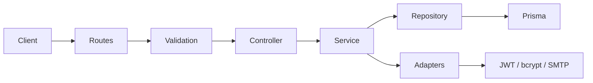

# hackathon2026

Full-stack TypeScript app split into two standalone projects in one Git repository:

- `backend/` - Express REST API, Prisma, PostgreSQL
- `frontend/` - Next.js App Router (port `3001`)

## backend architecture

`backend` follows layered, module-based design inspired by Clean Architecture: HTTP concerns stay at edges, business rules live in services, and infrastructure (database, mail, crypto) is wired through adapters and factories.

### Stack

| Layer       | Technology                                   |
| ----------- | -------------------------------------------- |
| Runtime     | Bun                                          |
| HTTP        | Express 5                                    |
| ORM         | Prisma 7 + PostgreSQL (`@prisma/adapter-pg`) |
| Validation  | Zod                                          |
| Auth tokens | JWT (`jsonwebtoken`)                         |
| Passwords   | bcrypt                                       |
| Email       | Nodemailer                                   |
| Env         | `@t3-oss/env-core` + Zod                     |
| Tests       | Vitest                                       |

### Request flow



1. Routes register endpoints under `/api/{module}` such as `/api/auth`.
2. Middlewares handle rate limiting, Zod validation (`validate`), and auth (`check-auth`).
3. Controllers map HTTP request/response and delegate to services.
4. Services hold business logic and depend on protocols, not concrete libraries.
5. Repositories handle data access via Prisma.
6. Adapters implement protocols for bcrypt, JWT, and Nodemailer.

Errors bubble to global `errorHandler`; unknown routes return `404` JSON.

### Folder layout (`backend/src/`)

```text
src/
|-- index.ts
|-- config/
|   |-- app.ts
|   |-- routes.ts
|   `-- env/
|-- docs/
|-- factories/
|   `-- auth/
|-- infrastructure/
|   `-- database/
|-- modules/
|   `-- auth/
|       |-- controller/
|       |-- middlewares/
|       |-- protocols/
|       |-- repository/
|       |-- routes/
|       |-- service/
|       `-- validations/
|-- shared/
|   |-- adapters/
|   |-- errors/
|   |-- middlewares/
|   `-- types/
`-- types/
```

Prisma schemas live in `backend/prisma/schema/`; generated client lives in `backend/prisma/generated/`.

### Conventions

- Route discovery: any `src/modules/{name}/routes/*routes.ts` file mounts at `/api/{name}` automatically.
- Factories: dependencies are assembled in `factories/`.
- Protocols vs adapters: services depend on interfaces in `modules/*/protocols/`; concrete implementations live in `shared/adapters/`.
- Validation at boundary: request bodies are validated with Zod before reaching controllers.

## Getting started

### backend

```bash
cd backend
cp .env.example .env
bun install
bun run db:start
bun run db:push
bun run dev
```

API base URL: `http://localhost:3000`

Swagger UI: `http://localhost:3000/api-docs`

### frontend

```bash
cd frontend
cp .env.example .env.local
bun install
bun run dev
```

Frontend URL: `http://localhost:3001`

Set `NEXT_PUBLIC_SERVER_URL` in `frontend/.env.local` to backend base URL.

Set `CORS_ORIGIN` in `backend/.env` to frontend origin.

## Scripts

| Project    | Dev           | Build           | Tests                              |
| ---------- | ------------- | --------------- | ---------------------------------- |
| `backend`  | `bun run dev` | `bun run build` | `bun run test`, `bun run test:e2e` |
| `frontend` | `bun run dev` | `bun run build` | -                                  |

## Lint and format

```bash
cd backend && bun run lint && bun run format:check
cd frontend && bun run lint && bun run format:check
```

Git hooks: `cd backend && bun install` configures Husky. Pre-commit runs backend tests.

## Auth API

| Method | Path                               |
| ------ | ---------------------------------- |
| POST   | `/api/auth/signup`                 |
| POST   | `/api/auth/login`                  |
| POST   | `/api/auth/refresh`                |
| POST   | `/api/auth/request-password-reset` |
| POST   | `/api/auth/reset-password`         |

Health: `GET /` returns `OK`.
