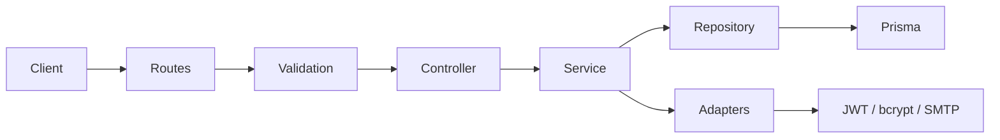

# hackathon2026

Full-stack TypeScript app split into two standalone projects in one Git repository:

- **Backend/** — Express REST API, Prisma, PostgreSQL
- **Front/** — Next.js App Router (port 3001)

There is no Turborepo, no npm workspaces, and no tRPC. The Front talks to the Backend over HTTP JSON.

## Backend architecture

The Backend follows a **layered, module-based** design inspired by Clean Architecture: HTTP concerns stay at the edges, business rules live in services, and infrastructure (database, mail, crypto) is wired through adapters and factories.

### Stack

| Layer | Technology |
|-------|------------|
| Runtime | Bun |
| HTTP | Express 5 |
| ORM | Prisma 7 + PostgreSQL (`@prisma/adapter-pg`) |
| Validation | Zod |
| Auth tokens | JWT (`jsonwebtoken`) |
| Passwords | bcrypt |
| Email | Nodemailer |
| Env | `@t3-oss/env-core` + Zod |
| Tests | Vitest |

### Request flow



1. **Routes** — register endpoints under `/api/{module}` (e.g. `/api/auth`).
2. **Middlewares** — rate limiting, Zod validation (`validate`), optional auth (`check-auth`).
3. **Controller** — maps HTTP request/response; delegates to the service.
4. **Service** — business logic; depends on **protocols** (interfaces), not concrete libs.
5. **Repository** — data access via Prisma.
6. **Adapters** — implementations of protocols (bcrypt, JWT, Nodemailer) in `shared/adapters/`.

Errors bubble to a global `errorHandler`; unknown routes return 404 JSON.

### Folder layout (`Backend/src/`)

```
src/
├── index.ts                 # Entry: load env, create app, listen
├── config/
│   ├── app.ts               # Express setup (CORS, JSON, routes, errors)
│   ├── routes.ts            # Auto-discover *routes.ts under modules/
│   └── env/                 # Typed environment (Zod schema)
├── factories/               # Composition root (manual DI)
│   └── auth/                # makeAuthController, makeAuthService, makeCheckAuth
├── infrastructure/
│   └── database/            # Prisma client singleton
├── modules/                 # Feature modules (one folder per domain)
│   └── auth/
│       ├── routes/          # Route registrar (default export)
│       ├── controller/
│       ├── service/
│       ├── repository/
│       ├── protocols/       # IPasswordHasher, ITokenService, IMailer
│       ├── validations/     # Zod schemas per endpoint
│       └── middlewares/     # Module-specific middleware (e.g. check-auth)
├── shared/
│   ├── adapters/            # cryptography, mailer
│   ├── middlewares/         # validate, rate-limit, error-handler
│   ├── errors/              # HttpError hierarchy
│   └── types/
└── types/                   # Express augmentation (e.g. req.user)
```

Prisma schemas live in `Backend/prisma/schema/`; the generated client is under `prisma/generated/`.

### Conventions

- **Module discovery** — any `src/modules/{name}/routes/*routes.ts` file is mounted at `/api/{name}` without manual registration in `app.ts`.
- **Factories** — dependencies are assembled in `factories/` (e.g. `makeAuthService` injects repository + bcrypt + JWT + mailer). Controllers and services stay easy to unit-test with mocks.
- **Protocols vs adapters** — services depend on interfaces in `modules/*/protocols/`; concrete implementations live in `shared/adapters/`.
- **Validation at the boundary** — request bodies are validated with Zod schemas in `modules/*/validations/` before reaching the controller.

Adding a new domain module: create `src/modules/{feature}/` with `routes/{feature}-routes.ts` (default export registrar), then add `controller`, `service`, `repository`, and a factory under `factories/{feature}/`.

## Getting started

### Backend

```bash
cd Backend
cp .env.example .env   # edit DATABASE_URL and secrets
bun install
bun run db:start       # optional: Docker Postgres
bun run db:push
bun run dev            # http://localhost:3000
```

### Front

```bash
cd Front
cp .env.example .env.local
bun install
bun run dev            # http://localhost:3001
```

Set `NEXT_PUBLIC_SERVER_URL` in `Front/.env.local` to the Backend base URL (default `http://localhost:3000`).

Set `CORS_ORIGIN` in `Backend/.env` to the Front origin (default `http://localhost:3001`).

## Scripts (per project)

| Project  | Dev              | Build           | Tests           |
|----------|------------------|-----------------|-----------------|
| Backend  | `bun run dev`    | `bun run build` | `bun run test`  |
| Front    | `bun run dev`    | `bun run build` | —               |

## Lint and format

Run inside each project:

```bash
cd Backend && bun run lint && bun run format:check
cd Front && bun run lint && bun run format:check
```

Git hooks: `cd Backend && bun install` configures Husky automatically. The pre-commit hook runs Backend tests.

## Auth API (REST)

| Method | Path |
|--------|------|
| POST | `/api/auth/signup` |
| POST | `/api/auth/login` |
| POST | `/api/auth/refresh` |
| POST | `/api/auth/request-password-reset` |
| POST | `/api/auth/reset-password` |

Health: `GET /` returns `OK`.
