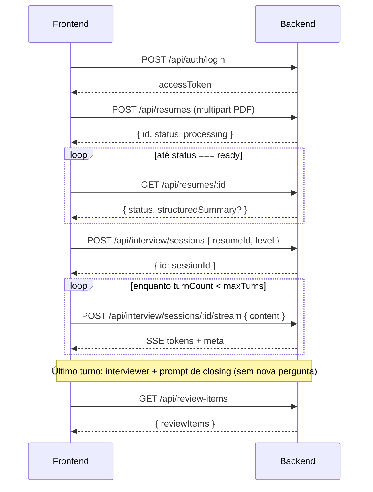
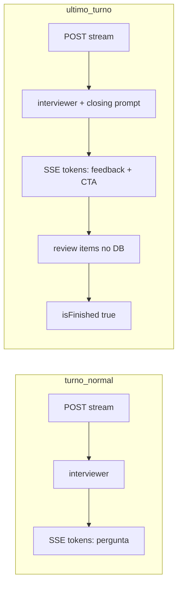

# API — Mock Interview (guia para o frontend)

Documento de integração para consumir o backend de **entrevista simulada com IA**, cobrindo:

1. **AI Mock Interview** — upload de currículo, sessão, chat via SSE e histórico.
2. **Interview Closing Feedback** — comportamento do **último turno** (feedback de encerramento em vez de nova pergunta do entrevistador).

> **Base URL:** `{API_ORIGIN}/api` (ex.: `http://localhost:3000/api` se o backend roda na porta 3000).

---

## Índice

1. [Visão geral do fluxo](#visão-geral-do-fluxo)
2. [Autenticação](#autenticação)
3. [Convenções](#convenções)
4. [Currículos (`/resumes`)](#currículos-resumes)
5. [Entrevista (`/interview`)](#entrevista-interview)
6. [Streaming SSE (`POST .../stream`)](#streaming-sse-post-sessionidstream)
7. [Como a entrevista funciona (turnos e nós)](#como-a-entrevista-funciona-turnos-e-nós)
8. [Itens de revisão (review items)](#itens-de-revisão-review-items)
9. [Erros HTTP](#erros-http)
10. [CORS e limitações](#cors-e-limitações)
11. [Sugestão de estados na UI](#sugestão-de-estados-na-ui)

---

## Visão geral do fluxo



**Ordem recomendada na UI:**

1. Login → guardar `accessToken`.
2. Upload do PDF → guardar `resumeId` → polling em `GET /resumes/:id` até `ready` ou `failed`.
3. Escolher nível (`entry` | `mid` | `senior`) → `POST /interview/sessions`.
4. Tela de chat: cada resposta do candidato → `POST .../stream` e consumir SSE.
5. No último turno, exibir a mensagem de **feedback final** (não é pergunta) e direcionar para a aba de itens de revisão (quando existir endpoint ou mock).

---

## Autenticação

Todas as rotas deste documento (exceto auth pública) exigem header:

```http
Authorization: Bearer <accessToken>
```

O `userId` vem **somente do JWT**; não envie `userId` no body.

### Login (referência)

| Método | Path | Body |
|--------|------|------|
| `POST` | `/api/auth/login` | Credenciais conforme módulo auth do projeto |

**Resposta (200):**

```json
{
  "accessToken": "eyJ...",
  "refreshToken": "..."
}
```

**Erros comuns:** `401` com `{ "message": "..." }` se o token estiver ausente, inválido ou expirado.

---

## Convenções

| Tópico | Detalhe |
|--------|---------|
| **JSON** | Campos em **camelCase** (`resumeId`, `turnCount`, `structuredSummary`). |
| **Datas** | ISO 8601 em JSON (`createdAt`). |
| **IDs** | UUID para currículo, sessão e mensagens. |
| **Erros** | Corpo `{ "message": "string" }` e status HTTP adequado. |
| **Ownership** | Recursos de outro usuário retornam `404` (sem vazar existência). |

---

## Currículos (`/resumes`)

O currículo é processado **de forma assíncrona** após o upload. A entrevista só pode começar com status `ready`.

### `POST /api/resumes` — Upload PDF

**Content-Type:** `multipart/form-data`  
**Campo do arquivo:** `file` (único arquivo PDF)

**Validações:**

- MIME: `application/pdf`
- Tamanho máximo: `RESUME_MAX_BYTES` (padrão **5 MB** = 5_242_880 bytes)

**Resposta (201):**

```json
{
  "id": "550e8400-e29b-41d4-a716-446655440000",
  "name": "curriculo.pdf",
  "status": "processing",
  "createdAt": "2026-05-27T12:00:00.000Z"
}
```

**Erros:**

| Status | Quando |
|--------|--------|
| `400` | Sem arquivo, não é PDF, ou excede tamanho |
| `401` | Não autenticado |
| `502` | Falha ao enviar para storage |
| `503` | Fila de processamento indisponível |

### `GET /api/resumes/:id` — Status e resumo estruturado

Use para **polling** após o upload (intervalo sugerido: 2–5 s até `ready` ou `failed`).

**Resposta (200) — ainda processando:**

```json
{
  "id": "...",
  "name": "curriculo.pdf",
  "status": "processing",
  "createdAt": "..."
}
```

**Resposta (200) — pronto:**

```json
{
  "id": "...",
  "name": "curriculo.pdf",
  "status": "ready",
  "createdAt": "...",
  "structuredSummary": {
    "personal_info": {
      "name": "Maria Silva",
      "title": "Desenvolvedora Backend",
      "about": "opcional"
    },
    "skills": ["TypeScript", "Node.js"],
    "experiences": [
      {
        "company": "Empresa X",
        "role": "Dev Pleno",
        "highlights": ["API REST", "PostgreSQL"]
      }
    ],
    "projects": [
      {
        "name": "Projeto Y",
        "description": "opcional",
        "technologies": ["opcional"],
        "highlights": ["opcional"]
      }
    ],
    "certifications": ["opcional"]
  }
}
```

**Status possíveis:** `processing` | `ready` | `failed`

> Quando `failed`, o backend persiste `errorMessage` no banco, mas **não expõe** esse campo no `GET` atual — trate `failed` na UI com mensagem genérica e opção de reenviar o PDF.

---

## Entrevista (`/interview`)

Prefixo das rotas: `/api/interview`.

### Limites de turnos por nível

| `level` | `maxTurns` (respostas do candidato por sessão) |
|---------|-----------------------------------------------|
| `entry` | 5 |
| `mid`   | 7 |
| `senior`| 8 |

Cada **turno** = uma mensagem do candidato (`human`) + uma resposta da IA (`ai`).

O backend expõe `turnCount` e `maxTurns` na listagem de sessões e no evento SSE `meta`.

---

### `POST /api/interview/sessions` — Criar sessão

**Body:**

```json
{
  "resumeId": "uuid-do-curriculo",
  "level": "entry"
}
```

`level`: `"entry"` | `"mid"` | `"senior"`

**Resposta (201):**

```json
{
  "id": "uuid-da-sessao"
}
```

**Pré-requisitos:**

- Currículo existe, pertence ao usuário autenticado e `status === "ready"`.

**Erros:**

| Status | Mensagem típica |
|--------|-----------------|
| `400` | `Resume is still being processed` / `Resume processing failed` / `Resume is not ready for interview` |
| `404` | Currículo inexistente ou de outro usuário |
| `401` | Não autenticado |

---

### `GET /api/interview/sessions` — Listar sessões do usuário

**Resposta (200):**

```json
{
  "sessions": [
    {
      "id": "uuid",
      "resumeId": "uuid",
      "level": "mid",
      "turnCount": 3,
      "maxTurns": 7,
      "isFinished": false,
      "createdAt": "2026-05-27T12:00:00.000Z"
    }
  ]
}
```

Ordenação: mais recentes primeiro (`createdAt` desc).

---

### `GET /api/interview/sessions/:sessionId/messages` — Histórico do chat

**Resposta (200):**

```json
{
  "messages": [
    {
      "id": "uuid",
      "role": "human",
      "content": "Minha resposta...",
      "createdAt": "..."
    },
    {
      "id": "uuid",
      "role": "ai",
      "content": "Pergunta ou feedback do entrevistador...",
      "createdAt": "..."
    }
  ]
}
```

`role`: `"human"` | `"ai"` — ordem cronológica por `createdAt`.

**Erros:** `404` se a sessão não existir ou não pertencer ao usuário.

**Uso na UI:**

- Ao abrir uma sessão existente, carregue o histórico antes de permitir novo envio.
- Se `isFinished === true`, desabilite o input e mostre que a entrevista terminou.

---

## Streaming SSE (`POST .../stream`)

### `POST /api/interview/sessions/:sessionId/stream`

Envia a **resposta do candidato** e recebe a resposta da IA em **Server-Sent Events**.

**Body:**

```json
{
  "content": "Texto da resposta do candidato (não vazio após trim)"
}
```

**Headers da requisição:**

```http
Authorization: Bearer <token>
Content-Type: application/json
Accept: text/event-stream
```

**Resposta:** `200` com corpo `text/event-stream` (não é JSON único).

### Formato dos eventos SSE

O backend escreve eventos no formato padrão SSE:

```
event: token
data: {"content":"trecho"}

event: meta
data: {"turnCount":1,"maxTurns":5,"isFinished":false}

data: [DONE]

```

| Evento | Payload `data` | Quando |
|--------|----------------|--------|
| `token` | `{ "content": "string" }` | Fragmento de texto da IA (concatene na UI) |
| `meta` | `{ "turnCount": number, "maxTurns": number, "isFinished": boolean }` | Após a IA terminar e o turno ser persistido |
| `error` | `{ "message": "string" }` | Falha durante o stream |
| *(sem event name)* | `[DONE]` | Fim do stream (sempre após sucesso ou após `error`) |

### Consumo no frontend

`EventSource` nativo **não serve** aqui (só suporta GET). Use **`fetch` + `ReadableStream`** ou biblioteca equivalente:

```typescript
async function streamTurn(
  sessionId: string,
  content: string,
  accessToken: string,
  onToken: (chunk: string) => void,
  onMeta: (meta: { turnCount: number; maxTurns: number; isFinished: boolean }) => void,
) {
  const res = await fetch(
    `${API_ORIGIN}/api/interview/sessions/${sessionId}/stream`,
    {
      method: "POST",
      headers: {
        Authorization: `Bearer ${accessToken}`,
        "Content-Type": "application/json",
        Accept: "text/event-stream",
      },
      body: JSON.stringify({ content }),
    },
  );

  if (!res.ok) {
    const err = await res.json().catch(() => ({ message: res.statusText }));
    throw new Error(err.message);
  }

  const reader = res.body!.getReader();
  const decoder = new TextDecoder();
  let buffer = "";

  while (true) {
    const { done, value } = await reader.read();
    if (done) break;
    buffer += decoder.decode(value, { stream: true });

    const blocks = buffer.split("\n\n");
    buffer = blocks.pop() ?? "";

    for (const block of blocks) {
      if (block.includes("data: [DONE]")) continue;

      const eventMatch = block.match(/^event: (\w+)/m);
      const dataMatch = block.match(/^data: (.+)$/m);
      if (!dataMatch) continue;

      const event = eventMatch?.[1];
      const data = JSON.parse(dataMatch[1]);

      if (event === "token") onToken(data.content);
      if (event === "meta") onMeta(data);
      if (event === "error") throw new Error(data.message);
    }
  }
}
```

### Guardas antes de abrir o stream

O backend valida **antes** de iniciar o SSE:

| Condição | Status |
|----------|--------|
| Sessão inexistente / outro usuário | `404` |
| `isFinished === true` ou `turnCount >= maxTurns` | `409` — `"Interview session is finished"` |
| Body inválido (`content` vazio) | `400` |

### Comportamento em desconexão

Se o cliente **abortar** a conexão no meio do stream:

- O processamento no servidor para.
- A mensagem `human` **já foi salva** no início do turno.
- A mensagem `ai` pode **não** ser persistida se o stream não completou.
- Itens de revisão e `markFinished` **não** rodam se o turno final foi interrompido.

Na UI: trate abort como turno incompleto; considere recarregar mensagens com `GET .../messages`.

---

## Como a entrevista funciona (turnos e nós)

### Turnos normais (não é o último)

Quando `turnCount + 1 < maxTurns`:

1. Backend persiste mensagem `human`.
2. Grafo LangGraph executa o nó **`interviewer`** (Tech Lead faz **nova pergunta**).
3. Tokens são enviados via SSE (`event: token`).
4. Mensagem `ai` é salva; `turnCount` incrementa.
5. SSE `meta` com `isFinished: false` + `[DONE]`.

### Último turno — Closing Feedback

Quando `turnCount + 1 >= maxTurns` (critério interno: `runReview: true`):

1. Backend persiste mensagem `human`.
2. Grafo executa o nó **`interviewer`** com o prompt de **closing feedback** (`runReview: true`).
3. A IA envia **feedback geral** da entrevista (sem nova pergunta).
4. O backend acrescenta um **CTA fixo em inglês** sobre a aba de review items após o texto gerado pela IA (não é gerado pelo modelo).
5. Mensagem `ai` salva; `turnCount` incrementa.
6. Backend gera **itens de revisão estruturados** (LLM separado), faz merge no banco e marca `isFinished: true`.
7. SSE `meta` com `isFinished: true` + `[DONE]`.



### Implicações para o chat na UI

| Turno | O que o usuário vê na bolha `ai` |
|-------|----------------------------------|
| 1 … N-1 | Pergunta do entrevistador (texto simples) |
| N (último) | Feedback de encerramento em **Markdown** (CommonMark: parágrafo + `##` + listas `-`) + CTA em texto simples |

No último turno, `content` é uma string Markdown compatível com **remark** / `react-markdown`. Acumule os tokens do SSE e renderize após o stream (remark não é incremental). O CTA fixo em inglês vem após `\n\n` e renderiza como parágrafo normal.

**Não espere** uma pergunta do entrevistador no último turno.

**Contador na UI:** use `turnCount` / `maxTurns` do `meta` ou da sessão. Ex.: `entry` com `maxTurns: 5` → após o 5º envio do candidato, `isFinished` passa a `true`.

### Primeira mensagem da sessão

O backend **não** envia mensagem inicial da IA automaticamente. Fluxos possíveis:

- **Opção A:** UI mostra texto fixo de boas-vindas e o candidato envia a primeira resposta (dispara o 1º stream).
- **Opção B:** Backend futuro com mensagem inicial (não implementado hoje).

---

## Itens de revisão (review items)

Após o **último turno** com sucesso, o backend:

- Gera tópicos `{ topic, description, priority }` com `priority`: `low` | `medium` | `high`.
- Faz **merge** por usuário + `topic` (sem duplicar; prioridade só sobe).

### Listar itens (`GET /api/review-items`)

| Método | Path | Auth |
|--------|------|------|
| `GET` | `/api/review-items` | Bearer |

**Resposta `200`:**

```json
{
  "reviewItems": [
    {
      "id": "550e8400-e29b-41d4-a716-446655440000",
      "sessionId": "660e8400-e29b-41d4-a716-446655440001",
      "topic": "system design",
      "description": "Practice scalability patterns and trade-offs.",
      "priority": "high",
      "createdAt": "2026-05-28T12:00:00.000Z",
      "updatedAt": "2026-05-29T10:30:00.000Z"
    }
  ]
}
```

- `priority`: `low` | `medium` | `high` (badge / cor na UI).
- Ordenação: **prioridade** (`high` → `medium` → `low`), depois `updatedAt` mais recente.
- Lista **agregada por usuário** (um tópico por `topic`, merge no backend).
- Sem itens: `{ "reviewItems": [] }` (não usar `404`).

**Sugestão de UI:** após `meta.isFinished === true` no último stream, chamar este endpoint (ou refetch ao abrir a aba). O CTA no closing feedback já aponta para essa aba.

---

## Erros HTTP

| Status | Uso |
|--------|-----|
| `400` | Validação (body, PDF, currículo não pronto) |
| `401` | Token ausente/inválido |
| `404` | Recurso não encontrado ou não pertence ao usuário |
| `409` | Sessão já finalizada (novo stream bloqueado) |
| `502` | Falha de storage no upload |
| `503` | Fila de processamento indisponível |
| `500` | Erro interno (`{ "message": "Internal Server Error" }`) |

### Erros durante SSE

- Resposta já começou como `200` + stream.
- Falha no meio → `event: error` + `[DONE]`.
- Se o turno era o **final** e a geração de review items falhar após os tokens de closing, a sessão **pode permanecer** `isFinished: false` (política atual: não marcar como finalizada se o pós-processamento falhar).

---

## CORS e limitações

Configuração atual do backend:

- **Origins:** valor de `CORS_ORIGIN` no `.env` do servidor.
- **Métodos permitidos:** `GET`, `POST`, `OPTIONS`.
- **Headers:** `Content-Type`, `Authorization`.
- **Credentials:** `true` (cookies só se o frontend enviar `credentials: "include"`).

Não há WebSocket; toda interação em tempo real da entrevista é **SSE sobre POST**.

---

## Sugestão de estados na UI

### Currículo

```
idle → uploading → polling(processing) → ready | failed
```

- `ready`: habilitar “Iniciar entrevista”.
- `failed`: permitir novo upload.

### Sessão de entrevista

```
active (turnCount < maxTurns && !isFinished)
  → streaming (aguardando SSE)
  → active

final_turn (próximo envio será o último)
  → streaming (closing feedback)
  → generating_review (opcional: loading na aba de revisão)
  → finished

finished (isFinished)
  → somente leitura do histórico
```

### Desabilitar envio quando

- `isFinished === true`, ou
- `turnCount >= maxTurns`, ou
- stream em andamento (evitar double submit → `409`).

---

## Referência rápida de rotas

| Método | Path | Descrição |
|--------|------|-----------|
| `POST` | `/api/resumes` | Upload PDF |
| `GET` | `/api/resumes/:id` | Status + `structuredSummary` se `ready` |
| `POST` | `/api/interview/sessions` | Criar sessão |
| `GET` | `/api/interview/sessions` | Listar sessões |
| `GET` | `/api/interview/sessions/:sessionId/messages` | Histórico |
| `POST` | `/api/interview/sessions/:sessionId/stream` | Turno (SSE) |
| `GET` | `/api/review-items` | Tópicos de estudo do usuário |

---

## Specs de origem (backend)

- [AI Mock Interview spec](../../.specs/features/ai-mock-interview/spec.md)
- [AI Mock Interview design](../../.specs/features/ai-mock-interview/design.md)

---

*Última atualização: alinhado à implementação em `src/modules/resumes` e `src/modules/interview`.*
